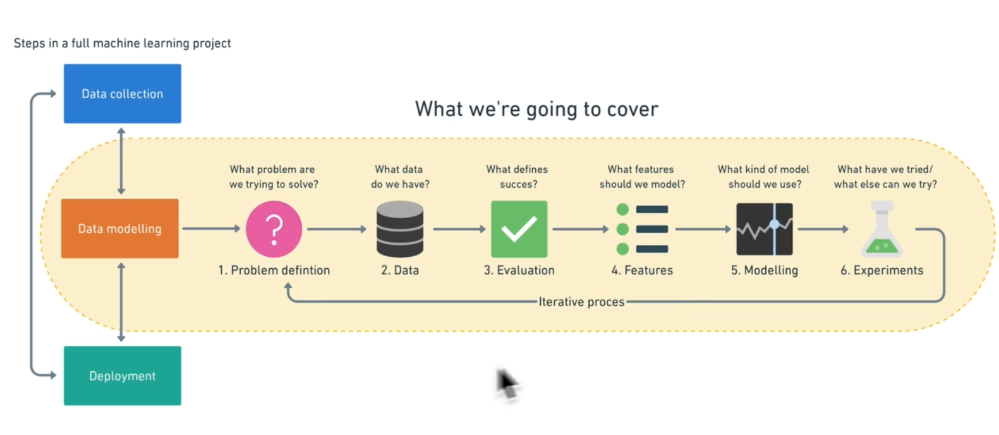

# What is Machine Learning

Machine learning is a process where a machine learns about a certain topic. This topic can be identifying what a apple is, identifying what a cat is, learning the past prices of a apartment in a area etc.

---
# How does Machine Learning differs from conventional programming?

In Conventional programming, you create a program with some predefined set of rules. When given a input, the program looks at the set of rules and gives the appropriate output.

In Machine Learning, you dont define rules. Machine will automatically learn multiple rules regarding a certain topic. When given a input, machine will give you the appropriate output based upon what it has learned.

---
# How does machine learns to create rules on its own?

In order for a machine to learn rules on its own, you have to train it. You train the machine based upon large sets of data. Machine will analyze the data and generate rules on its own.

Example: Lets say you want to crete a machine that can identify if a given picture is a dog or cat. You need to perform these steps:

1. First you need to teach machine how a cat and dog looks like. Lets say you have a lot of pictures of a dog and cat. You give all those pictures to the machine. Each picture also have a label associated with it.
2. Now, machine will use a algorithm(model) to repesent that data in a mathematical way. By doing so, machine will be able to identify patterns present in the data.
3. After some time of learning, you decide to test the machine by giving a picture of dog. The machine will then identify patterns present in this picture and try to match those patterns with either dog or cat. Some patterns might match with cat but majority will match with dog. Thats how machine will know that this picture is of dog. 

---
# History of Machine Learning

Machine learning has only existed for a little over a decade. The primary reason for this is because of the amount of data that companies started to collect.

When we had less data, we could analyze the data ourself. But as the amount of collected data grew, analyzing the data and extracting useful business insights got harder. As compaies started to implement more and more features, analyzing data also got complex. There were too many parameters we needed to consider to derive meaningful insights from data.

So, companies instead decided to use machines. Machines can perform a lot of calculations and computations in same time compared to human. But the problem with machines was the lack of intellisense. Machines could only do what we explicitly ask them to do. So, a lot of reasearch was done on how to make machines intelligent. Scientists started to explore on making machine reason about something and take meaningful decisions. Hence, Machine Learning was born.

---
# Why should we use machine learning over conventional programming (explicitly defining all the rules)

The problem with conventional programming is related to vast amount of rules we need to define to accomplish a task.

Example: Lets say we want to define rules on how a cat will look like.

1. The main problem is how do we even define what a cat is to a machine?
2. Even if we could define how a brown cat looks like, what if we show a picture of white cat to a machine ? The machine will not understand that this picture is of cat unless we explicitly define the rules.
3. What if we show a cat that is covered in some clothes? Did we cover this scenario?

The biggest challenge is to actually define what a cat looks like? What if we define that cats have a certain height in the program and show a cat that has slightly more height. The program wont consider that object as cat.

So, if we want to cover multiple scenarios, we need to add more rules to the program. And this approach is not scalable at all if we want to build applications such as voice recognition, face recognition, speech to text etc. To make this kind of programs, we might need to define hundreds of thousands of rules.

This problem is solved by machine learning as machine learning doesnot require us to define the rules. We can just collect a million different images of cat and train the program. The program will determine rules itself. Now, the program will be able to identify almost any cat.

---
# Role of maths in machine learning

Machine learning algorithms(models) use mathematics that involves statistics, probability, linera algebra etc. While learning mathematics is important to build machine learning models, it is not required to get started with machine learning.

As you learn more and more about machine learning, you can dive deeper into all these mathematical concepts.

---
# Identifying which algorithm to use

If we want to apply Machine learning to acomplish a task, the first step is to identify the type of task/problem. In order to accomplish a task, we need to choose the correct machine learning algorithm.

Choosing correct machine learning algorithm depends upon what we want to accomplish and the kind of data we will use to train the model.

In machine learning, any problem is defined into few categories such as Regression, Classification, Supervised Learning, Unsupervised Learning etc. There are models available for all these problems. Depending upon your problem defintion, you will be using one or combination of these models.

---
# Steps involved in a Machine Learning Project

1. The first step is defining the problem we are trying to solve.
2. Then we need to collect the data. The data can be a structured data like tables or excel files or unstructured data like images, videos and so on.
3. Then we need to evaluate the sucess metric for our project. Will the prediction accuracy of 80% satisfy our needs or we need more?
4. Then we need to define features which will be extracted from the data collected in step 2. If we are trying to measure if someone has heart disease, then we will collect their medical records as data. From this data, we will extract their body weight, which is considered a feature.
5. Then depending upon our needs and collected data, we will select a a machine learning algorithm (model).
6. Then we will train the model and experiment with the final output. If we think that the choosen model is not perfect then we can try with another model. We might also modify some of the features of the data etc.

---
# Common machine learning tool workflow

First, open up a csv file in Jupiter notebook, then explore the data and perform data analysis using pandas, then make visualizations and compare different data points using matplotlib, and finally build machine learning models using scikit-learn

---
## Note

 > [!info]
 > Not all problems require machine learning solutions. Machine learning is a complicated solution.
 
 If your problem can be solved using conventional programming in much easier way than using machine learning, you should use conventional solutions.

